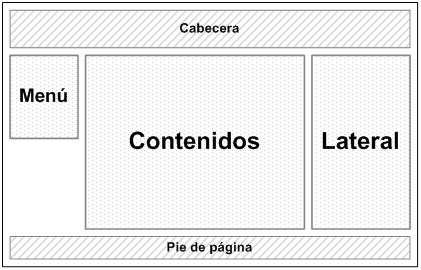

# Proyecto HTML5 y CCS

El proyecto consiste en realizar una web sobre alguna temática que te interese.

1. El primer paso será elegir el contenido que quiere mostrar en ella. 
2. El segundo elegir el diseño. Para ello podrás utilizar plantillas CSS ya diseñadas.
	Descarga la que te guste y estudia el código, tanto el HTML como el CSS. Se valorará de forma positiva el uso de hojas de etilos **adaptables** para que se visualice de manera optima en dispositivos móviles.
3. Modifica el HTML y el CSS de la plantilla para que se adapte a lo que necesitas. Puedes incluir los elementos que desees, para ello puedes utilizar código ya creado que puedas encontrar en Internet. 
4. Una vez concluida la página web, debes darte de alta en un servicio de hosting gratuito y subir la página a dicho hosting. 

## Características que debe tener el sitio web realizado

1. La página debe tener al menos 4 páginas webs enlazadas entre si.
2. La página debe estar hecha en HTML5 y todas las páginas deberán ser válidas.
3. El layout de las páginas realizadas debe tener al menos los siguientes componentes:
	* Cabecera (header) que incluye todos los elementos invariantes de la parte superior de la página (logotipo, imagen o banner, cuadro de búsqueda superior, etc.)
	* Contenido (content) engloba el contenido principal del sitio (la zona de noticias, la zona de artículos, la zona de productos, etc. dependiendo del tipo de sitio web)
	* Menú (menu o nav) se emplea para agrupar todos los elementos del menú lateral de navegación de la página
	* Pie (footer) que incluye todos los elementos invariantes de la parte inferior de la página (aviso de copyright, política de privacidad, términos de uso, etc.)
	* Lateral (sidebar o aside) se emplea para agrupar los elementos de las columnas laterales y secundarias de la página.

	

4. Se deben utilizar las etiquetas de texto estudiadas: títulos, párrafos, marcado de texto,...
5. Debe existir enlaces a páginas externas a nuestro sitio web.
6. Debe existir alguna lista ordenada y no ordenada.
7. Se deben incluir imágenes.
8. Debe existir al menos una tabla.
9. Debe existir un formulario que envíe los datos *http://www.gonzalonazareno.org/josedom/resultado.php*.
10. Todas las páginas deben tener un favicon.

## Documentación a entregar

Debes entregar un documento pdf donde se indidique los siguiente apartados:

* La URL del repositorio GitHub donde has ido guardando los cambios realizados.
* La URL de la página donde tienes alojada la página.
* La URL donde has encontrado las plantillas descargadas y los códigos extra que hayamos incluido en nuestra web (menús,javascript,...).
* Una breve explicación de cómo hemos subido la página al gosting gratuito que has elegido (¿Qué hoswting has escogido? ¿Qué cliente FTP has utilizado para subir la página?, ¿A qué directorio del servidor remoto has tenido que subir la página?,...)
* Capturas de pantalla donde se vea la validación de cada una de las páginas (tiene que parecer la URL de la página). Utilizar el [validador de W3C](https://validator.w3.org/#validate_by_uri).